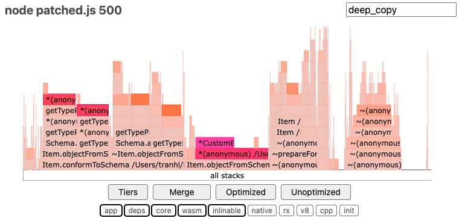

# Dynamoose Deep Copy Repro

Repo for reproducing degrading performance when querying large datasets/objects
using Dynamoose & DynamoDB Local.

Generates 1000 objects with a configurable number of object properties.
Lower property counts perform significantly better compared to higher property counts
in unpatched version of `dynamoose`. Performance in both scenarios is almost comparable
in patched version.

## Requirements

- Docker
- Node v18+
- pnpm

## Steps

1. `pnpm install`
2. `pnpm run dynamodb`
2. `pnpm run seed`
3. `pnpm run profile <count>`
    - Run using `count` of `5`, `250`, and `500`
    - Filter for `deep_copy` function in generated flamegraph
7. Repeat steps 3, running `pnpm run profile:patched <count>` instead

## Results

For small data sets, unpatched vs patched performance is roughly equivalent.

In the unpatched version of Dynamoose, query performance significantly
degrades as `deep_copy` fails to handle scaling object sizes due to the `isCircular`
check.

When patched, query performance is significantly faster, with `deep_copy` no
longer being the performance bottleneck. In fact, in large enough data sets (i.e.
in the case of 500 properties), it's performance footprint is not visible on the
scale.

### 5 properties

|            |           Unpatched            |           Patched            |
| :--------: | :----------------------------: | :--------------------------: |
|  Runtime   |           ~1300ms            |            ~1400ms            |
| Flamegraph |  |  |

### 250 properties

|            |           Unpatched            |           Patched            |
| :--------: | :----------------------------: | :--------------------------: |
|  Runtime   |             ~4900ms             |            ~2100ms            |
| Flamegraph |  |  |

### 500 properties

|            |           Unpatched            |           Patched            |
| :--------: | :----------------------------: | :--------------------------: |
|  Runtime   |             ~8200ms             |            ~3800ms            |
| Flamegraph |  |  |

